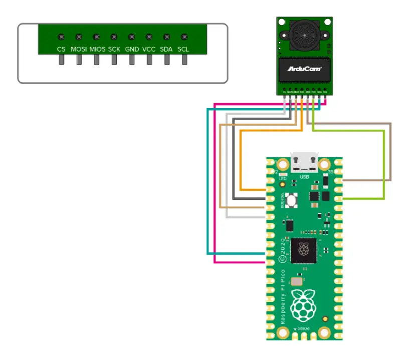

# SPICamDemo
# SPICamDemo

**Status:** Work in Progress 🚧  
**Focus:** Exploring SPI communication with a camera module (initially OV2640) and later shifting toward **SPI flash memory** for demonstration and learning.

---

## 🎯 Motivation

This project was started as part of my **learning process in embedded systems and communication protocols**.  
The goal was to understand how to:  

- Initialize and configure SPI peripherals on Raspberry Pi and Raspberry Pi Pico.  
- Communicate with external devices such as **SPI cameras** and **SPI flash memory**.  
- Replace the **USB camera** used in my [alarmSecuritySystem](https://github.com/milutin2002/alarmSecuritySystem) project with a lighter, SPI-based solution.  
- Gain practical experience in debugging low-level communication issues.  
- Build a foundation for future academic projects and professional work in embedded systems and hardware interfacing.  

Even though the camera integration is not yet complete, the project continues to serve as a valuable hands-on exercise and will be extended toward **SPI flash memory** for a clearer demonstration of the protocol.

---

## 📖 About

This repository is part of my learning journey with SPI (Serial Peripheral Interface).  
The initial goal was to connect and stream from an SPI camera (e.g., OV2640) using a Raspberry Pi Pico and Raspberry Pi.  
Since the camera integration is complex and not fully finished, the project is being **repurposed toward demonstrating SPI protocol with SPI flash memory**.  

The repo documents my experiments, test code, and progress with SPI communication.

---

## 📂 Repository Structure

SPICamDemo/
├── PI/ # Test/demo code for Raspberry Pi
├── Pico/Controller/ # Test/demo code for Raspberry Pi Pico
├── .gitignore
└── README.md

- **PI/** → SPI communication attempts on Raspberry Pi.  
- **Pico/Controller/** → Code targeting Raspberry Pi Pico (SDK + CMake).  

---

## 🛠️ Dependencies

- **Hardware**  
  - Raspberry Pi (for host-side tests)  
  - Raspberry Pi Pico (for microcontroller-side SPI demo)  
  - OV2640 (initial camera attempt) or SPI Flash Memory (new focus)  

- **Software**  
  - [Pico SDK](https://github.com/raspberrypi/pico-sdk)  
  - CMake + GCC toolchain  
  - Python (optional helper scripts)  

---

## 🔌 Circuit Diagram

Below is the wiring diagram for the SPI connection (Pico ↔ Camera / Flash):

## 🚀 Building & Running

1. Clone the repo:
    <pre><code>
   git clone https://github.com/milutin2002/SPICamDemo.git
   cd SPICamDemo
   </code></pre>
2. Enter the folder for your platform (e.g., PI/ or Pico/Controller/).
3. Build with CMake:
    <pre><code>
        cd pico
        mkdir build
        cd build
        cmake ..
        make
    </code></pre>
## ✨ Features / Goals

- [x] Basic SPI initialization and communication code  
- [ ] Interfacing with OV2640 camera (not complete)  
- [ ] Pivot to demonstrating SPI with Flash memory  
- [ ] Document wiring diagrams and test results  

## 📌 Notes

- This project is **not a production-ready camera driver**.  
- It is meant as a **learning/demo project** for SPI protocol.  
- Future commits will focus on **SPI flash memory** repository demos to showcase reliable SPI communication.  
